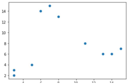

# K-means 알고리즘
- 다음 데이터를 3개의 그룹으로 나누고자 함

 

<table>
    <thead>
    </thead>
    <tbody>
        <tr>
            <td></td>
            <td>1</td>
            <td>2</td>
            <td>3</td>
            <td>4</td>
            <td>5</td>
            <td>6</td>
            <td>7</td>
            <td>8</td>
            <td>9</td>
            <td>10</td>
        </tr>
        <tr>
            <td>x1</td>
            <td>6</td>
            <td>8</td>
            <td>14</td>
            <td>11</td>
            <td>15</td>
            <td>7</td>
            <td>13</td>
            <td>5</td>
            <td>3</td>
            <td>3</td>
        </tr>
        <tr>
            <td>x2</td>
            <td>14</td>
            <td>13</td>
            <td>6</td>
            <td>8</td>
            <td>7</td>
            <td>15</td>
            <td>6</td>
            <td>4</td>
            <td>3</td>
            <td>2</td>
        </tr>
    </tbody>
</table>

## 단계 1 : 랜덤하게 3개의 객체를 선택함

 
<table>
    <thead>
    </thead>
    <tbody>
        <tr>
            <td></td>
            <td>x1</td>
            <td>x2</td>
        </tr>
        <tr>
            <td>c1</td>
            <td>11</td>
            <td>8</td>
        </tr>
        <tr>
            <td>c2</td>
            <td>15</td>
            <td>7</td>
        </tr>
        <tr>
            <td>c3</td>
            <td>7</td>
            <td>15</td>
        </tr>
    </tbody>
</table>

## 단계 2 : 센터에서 각좌표간 거리를 계산한다

 
<table>
    <thead>
    </thead>
    <tbody>
        <tr>
            <td></td>
            <td>1</td>
            <td>2</td>
            <td>3</td>
            <td>4</td>
            <td>5</td>
            <td>6</td>
            <td>7</td>
            <td>8</td>
            <td>9</td>
            <td>10</td>
        </tr>
        <tr>
            <td>c1</td>
            <td></td>
            <td></td>
        </tr>
        <tr>
            <td>c2</td>
            <td></td>
            <td></td>
        </tr>
        <tr>
            <td>c3</td>
            <td></td>
            <td></td>
        </tr>
    </tbody>
</table>

## 단계 3 : 세개의 그룹을 기준으로 센터를 다시 계산한다
- 1. 가장 가까운 센서를 기분으로 그룹을 나눔
- 2. 그룹된것을 기준으로 센터를 다시 계산한다(평균)

 

- c1 = {4,8,9,10}
- c2 = {3,5,7}
- c3 = {1,2,6}

 
<table>
    <thead>
    </thead>
    <tbody>
        <tr>
            <td></td>
            <td>x1</td>
            <td>x2</td>
        </tr>
        <tr>
            <td>c1</td>
            <td></td>
            <td></td>
        </tr>
        <tr>
            <td>c2</td>
            <td></td>
            <td></td>
        </tr>
        <tr>
            <td>c3</td>
            <td></td>
            <td></td>
        </tr>
    </tbody>
</table>

 
<table>
    <thead>
    </thead>
    <tbody>
        <tr>
            <td></td>
            <td>1</td>
            <td>2</td>
            <td>3</td>
            <td>4</td>
            <td>5</td>
            <td>6</td>
            <td>7</td>
            <td>8</td>
            <td>9</td>
            <td>10</td>
        </tr>
        <tr>
            <td>x1</td>
            <td></td>
            <td></td>
        </tr>
        <tr>
            <td>x2</td>
            <td></td>
            <td></td>
        </tr>
    </tbody>
</table>

 

## 단계 4 : 새로운 센터에서 다시 거리를 계산한다

 
<table>
    <thead>
    </thead>
    <tbody>
        <tr>
            <td></td>
            <td>1</td>
            <td>2</td>
            <td>3</td>
            <td>4</td>
            <td>5</td>
            <td>6</td>
            <td>7</td>
            <td>8</td>
            <td>9</td>
            <td>10</td>
        </tr>
        <tr>
            <td>c1</td>
            <td></td>
            <td></td>
        </tr>
        <tr>
            <td>c2</td>
            <td></td>
            <td></td>
        </tr>
        <tr>
            <td>c3</td>
            <td></td>
            <td></td>
        </tr>
    </tbody>
</table>

## 단계 5 : 세개의 그룹을 기준으로 센터를 다시 계산한다
- 1. 가장 가까운 센서를 기분으로 그룹을 나눔
- 2. 그룹된것을 기준으로 센터를 다시 계산한다(평균)

 

- c1 = {8,9,10}
- c2 = {3,5,7}
- c3 = {1,2,6}

 